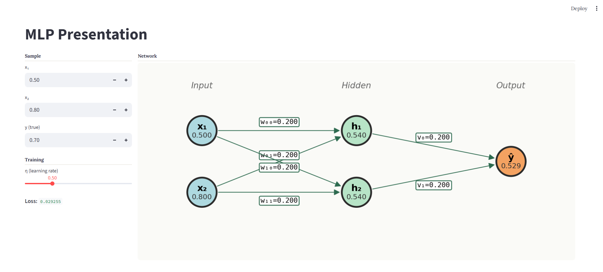
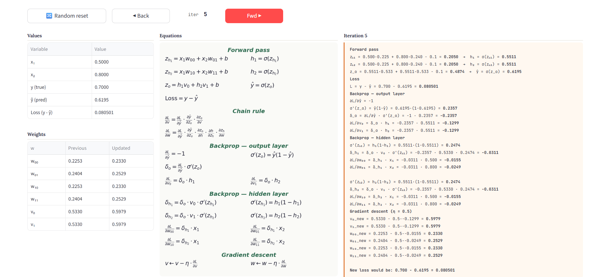

# MLP Presentation - Interactive Neural Network Visualizer

An interactive web application that visualizes how a Multilayer Perceptron (MLP) learns through backpropagation. Watch the network update in real-time as you step through training iterations!


*Main interface showing the network visualization and controls*

## 🎯 What is this?

This tool helps you understand the inner workings of a neural network by showing **every calculation** involved in:
- Forward propagation
- Loss computation
- Backpropagation
- Gradient descent

Perfect for students, teachers, or anyone curious about how neural networks actually learn!

## ✨ Features

- **Interactive Network Diagram** - See neurons and connections update in real-time
- **Step-by-Step Training** - Click "Fwd" to perform one iteration at your own pace
- **Complete Math Breakdown** - Every equation and calculation is displayed
- **Adjustable Parameters** - Change inputs, target values, and learning rate
- **Visual Feedback** - Colors show positive (green) and negative (red) weights


*Detailed calculations panel showing every mathematical step*

## 🚀 Quick Start

###  Run Locally

1. **Clone the repository**
```bash
git clone https://github.com/yourusername/mlp-presentation.git
cd mlp-presentation
2. **Install requirements**
```bash
pip install streamlit numpy matplotlib pandas
3. **Run the app**
```bash
streamlit run mlp_presentation.py
